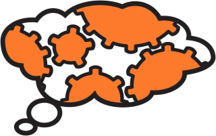

  

# Chordify TapCorrect Dataset
This repository contains supplemental material for the paper "Towards Automatically Correcting Tapped Beat Annotations for Music Recordings" by Jonathan Driedger, Hendrik Schreiber, W. Bas de Haas, and Meinard Müller, presented at ISMIR 2019 in Delft, the Netherlands.

## Abstract
A common method to create beat annotations for music recordings is to let a human annotator tap along to them.
However, this method is problematic due to the limited human ability to temporally align taps with audio cues for beats accurately.
In order to create accurate beat annotations, it is therefore typically necessary to manually correct the recorded taps in a subsequent step, which is a cumbersome task.
In this work we aim to automate this correction step by "snapping" the taps to close-by audio cues---a strategy that is often used by beat tracking algorithms to refine their beat estimates.
The main contributions of this paper can be summarized as follows.
First, we formalize the automated correction procedure mathematically.
Second, we introduce a novel visualization method that serves as a tool to analyze the results of the correction procedure for potential errors. 
Third, we present a new dataset consisting of beat annotations for 101 music recordings.
Fourth, we use this dataset to perform a listening experiment as well as a quantitative study to show the effectiveness of our snapping procedure.